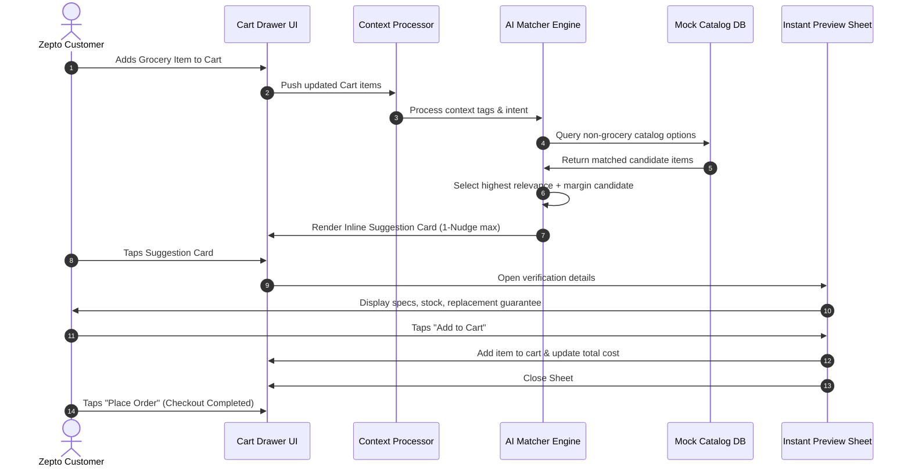

# Zepto AI Cross-Category Assistant — System Architecture

**Project Title:** Zepto AI Cross-Category Assistant MVP  
**Domain:** Quick Commerce (Q-Commerce) / Real-time Recommendation & In-Flow UI  
**Active Scope:** Web-Based Interactive MVP Prototype  
**Document Version:** 1.0.0  
**Status:** Approved Architectural Specification  

---

## 1. System Overview

The Zepto AI Cross-Category Assistant is designed to run locally on the client interface to process cart item contexts in real time and generate immediate, non-intrusive product recommendations. 

The architecture consists of four distinct sub-components:

```
+---------------------------------------------------------------------------------------+
|                                  ZEPTO CLIENT APP                                     |
|                                                                                       |
|   +-----------------------+              +----------------------------------------+   |
|   | 1. Cart Processor     | -----------> | 2. AI Matcher Engine                   |   |
|   | - Analyzes Cart Items |              | - Evaluates Rules, Routines            |   |
|   | - Extracts Categories |              | - Selects Best High-Margin Recommendation|  |
|   +-----------------------+              +----------------------------------------+   |
|               ^                                              |                        |
|               | (1-Tap Add)                                  | (Surfaces 1 Nudge)     |
|               |                                              v                        |
|   +-----------------------+              +----------------------------------------+   |
|   | 4. Fast Preview Sheet | <----------- | 3. In-Flow AI Surface                  |   |
|   | - Specs & Dark Stock  | (Taps Card)  | - Inline checkout recommendation card  |   |
|   | - Doorstep Guarantee  |              | - Instant payment pass-through         |   |
|   +-----------------------+              +----------------------------------------+   |
|                                                                                       |
+---------------------------------------------------------------------------------------+
```

---

## 2. Component breakdown

### 1. Universal Cart & Context Processor
* **Function:** Inspects the active items currently added to the checkout basket.
* **Input Context:** Extracts category tags, total item weight/dimensions, and search queries or current intent.
* **Flow Trigger:** Re-evaluates every time the user increments, decrements, or removes an item.

### 2. Cross-Category AI Matcher
* **Function:** Performs matching between the cart groceries and non-grocery catalog categories.
* **Match Heuristics:**
  * *Functional Utility:* e.g., milk/cereal $\rightarrow$ bowl, batteries/screwdrivers $\rightarrow$ remote control/gadget.
  * *Routine Pairing:* e.g., buying sunscreen/face wash $\rightarrow$ high-margin organic skincare serums.
  * *Compatibility:* e.g., smartphone cases/cables matched to specific device listings.
* **Nudge Limiter:** Caches recommendation states per session to guarantee the **Strict 1-Nudge Limit** constraint.

### 3. Non-Intrusive In-Flow AI Surface
* **Function:** A sleek, context-specific card embedded in the checkout drawer layout.
* **UI Features:**
  * Located immediately above the "Place Order" button.
  * Uses a subtle premium background gradient (e.g., Zepto purple-to-blue micro-gradient) with a clear, single-sentence hook (e.g., *"Need a fast phone charger for your kitchen?"*).
  * Does not prevent the user from clicking the main action button (Instant Pass-Through).

### 4. 1-Tap Instant Verification & Action Sheet
* **Function:** A fast bottom drawer or slide-over sheet triggered by clicking the recommendation nudge.
* **Data Fields:**
  * **Instant Specs/Verification:** Wattage, battery compatibility, ingredients list, or measurements.
  * **Dark Store stock confirmation:** Shows "In Stock - Local Dark Store" badge.
  * **Replacement Guarantee:** Displays "10-Minute Doorstep Replacement & Return Guarantee."
  * **Add to Cart Action:** Adds the item in a single tap without reloading checkout.

---

## 3. End-to-End Execution Flow


