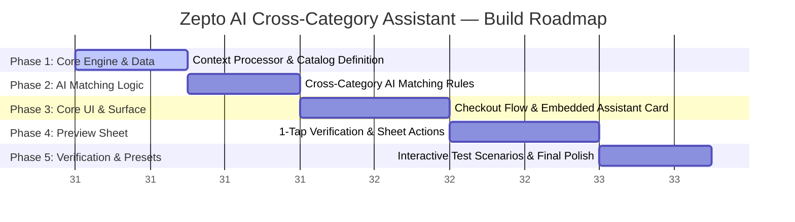

# Zepto AI Cross-Category Assistant — Phase-wise Implementation Strategy

**Project Title:** Zepto AI Cross-Category Assistant MVP Prototype  
**Domain:** Quick Commerce (Q-Commerce) / Real-time Recommendation & In-Flow UI  
**Active Build Scope:** Frontend/Backend Interactive Web Prototype  
**Document Version:** 1.0.0  
**Status:** Approved Engineering Roadmap  
**Reference Documents:**  
* [problemstatement.md](file:///c:/Users/DELL/OneDrive/Desktop/Krishna/Zepto%20MVP/Docs/problemstatement.md)  
* [Architecture.md](file:///c:/Users/DELL/OneDrive/Desktop/Krishna/Zepto%20MVP/Docs/Architecture.md)  

---

## 1. Executive Implementation Overview

This roadmap details the engineering phases required to prototype and test the Zepto AI Cross-Category Assistant. The output is a high-fidelity web application displaying a simulated mobile screen running the Zepto Cart Drawer next to a scenario selection panel.

---

## 2. Phase Breakdown & Engineering Deliverables

### Phase 1: Core Engine & Data Structures
* **Objective:** Define the catalog structure and establish the cart processor.
* **Deliverables:**
  * Create mock data schema representing core grocery items and high-margin non-grocery expansion categories.
  * Define category tags, routine matches, and functional pairing rules in `src/catalog.js`.
  * Establish the stateful cart model holding quantities, weights, and items.

---

### Phase 2: Cross-Category AI Matching Logic
* **Objective:** Implement the recommendation matching engine.
* **Deliverables:**
  * Build the context extraction logic (extracts active categories, items, and shopping mode).
  * Build matching heuristics (e.g., matching a phone charger when electronic/cables category is checked, or sunscreen with skincare routines).
  * Enforce the 1-nudge rule (caching recommendations so that only one unique nudge shows up per checkout session).

---

### Phase 3: In-Flow UI & Checkout Drawer Layout
* **Objective:** Build the simulated Zepto checkout interface.
* **Deliverables:**
  * Implement the responsive smartphone frame displaying the shopping cart drawer.
  * Code the inline, non-intrusive AI suggestion card right above the "Place Order" button.
  * Apply Zepto brand styling (deep violet backgrounds, clean layout, orange action alerts).
  * Guarantee that "Place Order" remains active and unblocked (Instant Pass-Through).

---

### Phase 4: 1-Tap Fast Preview Sheet
* **Objective:** Code the interactive specification verification and instant-add sheet.
* **Deliverables:**
  * Implement the slide-up sheet overlay activated when tapping the AI suggestion card.
  * Display dark store stock status ("In Stock - Local Dark Store") and the 10-minute replacements assurance.
  * Wire the 1-tap "Add to Cart" button to insert the recommended item directly into the active cart without reloading or resetting checkout.

---

### Phase 5: Interactive Scenario Presets & Final Polish
* **Objective:** Build the control panel to easily simulate and test different user shopping scenarios.
* **Deliverables:**
  * Implement the desktop controller panel allowing testers to trigger preset carts (e.g. "Tech Refill", "Cosmetics Routine").
  * Run UI validation checking responsiveness and transition animations.
  * Ensure full adherence to all strict UI/UX guardrails (no auto-adds, no full-screen overlays).
