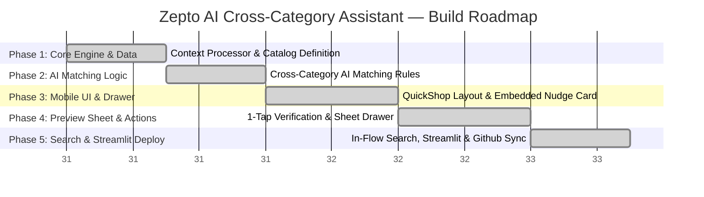

# Zepto AI Cross-Category Assistant — Phase-wise Implementation Strategy

**Project Title:** Zepto AI Cross-Category Assistant MVP Prototype  
**Domain:** Quick Commerce (Q-Commerce) / Real-time Recommendation & In-Flow UI  
**Active Build Scope:** Standalone Interactive Mobile Web MVP & Streamlit Cloud App  
**Document Version:** 1.2.0  
**Status:** Approved & Completed Engineering Roadmap  
**Reference Documents:**  
* [problemstatement.md](file:///c:/Users/DELL/OneDrive/Desktop/Krishna/Zepto%20MVP/Docs/problemstatement.md)  
* [Architecture.md](file:///c:/Users/DELL/OneDrive/Desktop/Krishna/Zepto%20MVP/Docs/Architecture.md)  

---

## 1. Executive Implementation Overview

This document details the completed engineering phases for building and deploying the **Zepto AI Cross-Category Assistant MVP**. The final deliverable is a standalone mobile cart drawer interface with real-time in-flow product search, automated cross-category AI matching, instant specification preview sheets, and a single-file Streamlit Cloud bundler (`streamlit_app.py`).

---

## 2. Phase Breakdown & Engineering Deliverables

### Phase 1: Core Engine & Data Structures — COMPLETE
* **Deliverables:**
  * Created mock data schemas representing core grocery items (milk, bread, eggs, vegetables, snacks) and high-margin non-grocery categories (electronics, cosmetics, utilities, pet care, baby care) in `src/catalog.js`.
  * Integrated product specifications (`specs`), stock count thresholds (`stock_count`), and doorstep replacement guarantees (`replacement_guarantee`).
  * Implemented the stateful `ZeptoCart` class in `src/cart.js` managing item additions, quantity updates, delivery partner fee waivers, and listener subscriptions.

---

### Phase 2: Cross-Category AI Matching Logic — COMPLETE
* **Deliverables:**
  * Developed the `ZeptoAIMatcher` engine in `src/ai_matcher.js` to process cart context and active search query inputs.
  * Implemented contextual matching heuristics (e.g., matching Samsung chargers with PowerPulse 25W adapters, breakfast items with fast chargers, or vegetables with sunscreens).
  * Built the **Anti-Thrashing Nudge Lock** (`lockedRecommendation`) to enforce the strict **1-Nudge limit** per checkout session.
  * Enforced inventory safety checks (`stock_count > 0`) and redundant recommendation filters.

---

### Phase 3: Mobile Cart Drawer UI & Layout Alignment — COMPLETE
* **Deliverables:**
  * Designed the standalone QuickShop mobile shell (`index.html` & `src/style.css`) matching the target mobile design specifications.
  * Built the QuickShop header, status bar, and your cart items card list.
  * Formatted the non-intrusive AI Assistant card (`✨ AI Assistant`) embedded directly above the bottom action bar.
  * Styled the high-contrast `Proceed to Pay ➔` checkout button and view bill link.

---

### Phase 4: 1-Tap Fast Preview Sheet — COMPLETE
* **Deliverables:**
  * Implemented the bottom slide-up preview sheet overlay activated when tapping the AI recommendation card.
  * Displayed real-time dark store stock status (*✓ In Stock*) and doorstep replacement assurances (*🛡️ 10-Min Doorstep Return/Exch*).
  * Formatted the product specifications table dynamically based on item category.
  * Integrated the 1-tap `Add to Cart & Checkout` button to update the cart instantly without page reloads.

---

### Phase 5: Functional In-Flow Search & Streamlit Deployment — COMPLETE
* **Deliverables:**
  * Built the interactive search results dropdown (`#search-results-dropdown`) directly under the mobile search bar (`🔍 Search for products...`).
  * Enabled real-time product filtering across both grocery and non-grocery catalogs as the user types.
  * Added 1-tap `+ Add` action buttons inside the search dropdown list to insert products directly into the cart.
  * Developed `streamlit_app.py` for Streamlit Cloud deployment, bundling HTML, CSS, and JS modules into a clean standalone iframe with zero top padding.
  * Synchronized code repository with GitHub at `https://github.com/kartikey-dotcom/Zepto-MVP.git`.
